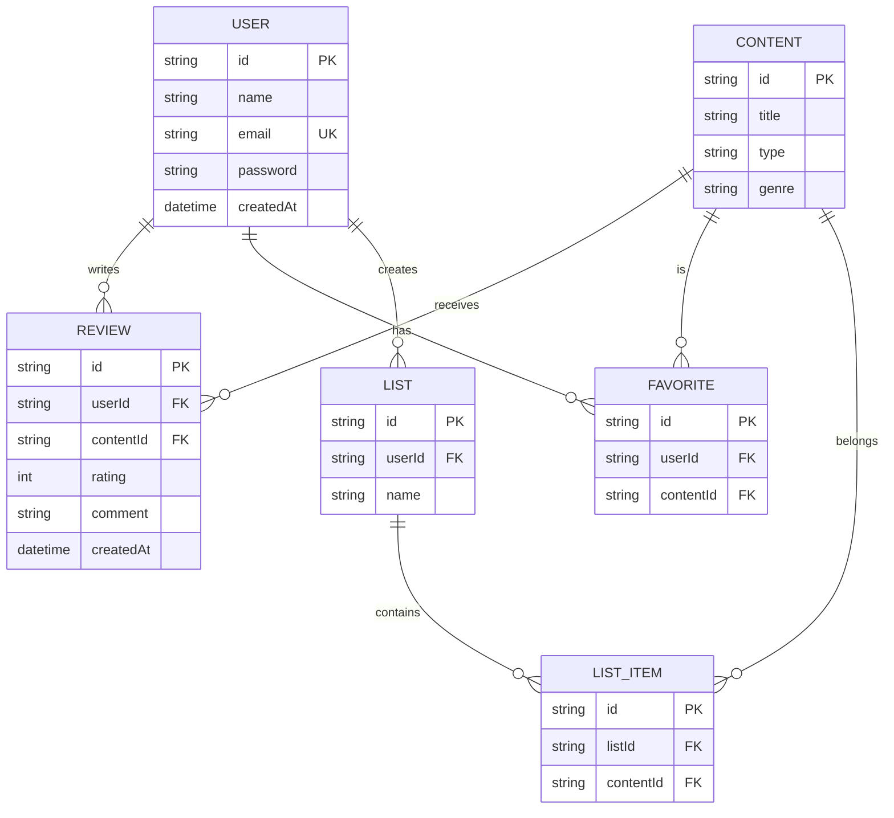

# 📐 Software Design Document (SDD) - VibeMatch

**Projeto:** VibeMatch (Mood-Based Media Recommender)  
**Versão:** 1.0.0  
**Status:**
**Stack Principal:** NestJS, Vue.js, Prisma ORM, PostgreSQL.

---

## 🏗️ 1. Arquitetura do Sistema (Estrutura Monorepo)

O projeto utiliza uma arquitetura de Monorepo:

- **`apps/api`**: Servidor Backend (NestJS)
- **`apps/web`**: Aplicação Client (Vue 3 + Vite)

---

## 🤖 2. Orquestração e Ecossistema de Contexto (MCP)

> **Instrução para a IA:** Utilize ferramentas de apoio para manter consistência entre requisitos e implementação.

- **GitHub Projects MCP:** Controle das User Stories e progresso do projeto.
- **Neon.tech MCP:** Gerenciamento do banco PostgreSQL.
- **Figma / IA UI Tools:** Prototipação das interfaces do sistema.

---

## 📦 3. Stack Tecnológica e Bibliotecas

### Core & Infraestrutura

- **Ambiente:** Node.js v20.x
- **Banco de Dados:** PostgreSQL (Neon.tech)
- **Backend:** NestJS v10.x
- **Frontend:** Vue 3 + Vite
- **ORM:** Prisma v5.x
- **Testes:** Jest + Supertest

---

### Bibliotecas Permitidas

- **Auth:** JWT (`@nestjs/jwt`, `@nestjs/passport`)
- **Validação:** `class-validator`, `class-transformer`
- **Documentação:** `@nestjs/swagger`
- **HTTP:** Axios (consumo de APIs externas)
- **Utilitários:** `date-fns`

---

## 🗄️ 4. Arquitetura de Dados

### 📖 4.1 Glossário Técnico

| Termo PRD     | Entidade Técnica | Atributos                 |
| ------------- | ---------------- | ------------------------- |
| Usuário       | `User`           | id, name, email, password |
| Conteúdo      | `Content`        | id, title, type, genre    |
| Avaliação     | `Review`         | id, rating, comment       |
| Favorito      | `Favorite`       | id, userId, contentId     |
| Lista         | `List`           | id, name                  |
| Item da Lista | `ListItem`       | id, listId, contentId     |

---

### 🗄️ 4.2 Modelagem de Dados

